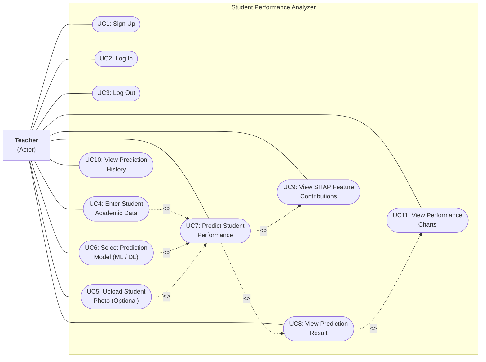

# Use Case Diagram

## Description

The Use Case Diagram shows all interactions between the Teacher (primary actor) and the Student Performance Analyzer system. It identifies 11 use cases covering authentication, data entry, prediction, and history review.

## Diagram

## Use Case Specifications

### UC1: Sign Up

| Field | Description |
|-------|-------------|
| **Actor** | Teacher |
| **Precondition** | Teacher does not have an existing account |
| **Main Flow** | 1. Teacher opens the application. 2. Clicks "Sign Up" tab. 3. Enters name, email, and password. 4. System validates input and creates account. 5. System issues JWT token and redirects to main interface |
| **Postcondition** | Teacher account is created in the database; teacher is logged in |
| **Alternate Flow** | If email already exists, system shows error "Email already registered" |

### UC2: Log In

| Field | Description |
|-------|-------------|
| **Actor** | Teacher |
| **Precondition** | Teacher has an existing account |
| **Main Flow** | 1. Teacher opens the application. 2. Enters email and password. 3. System verifies credentials against stored hash. 4. System issues JWT token and redirects to main interface |
| **Postcondition** | Teacher is authenticated; JWT token stored in browser |
| **Alternate Flow** | If credentials are invalid, system shows error "Invalid email or password" |

### UC3: Log Out

| Field | Description |
|-------|-------------|
| **Actor** | Teacher |
| **Precondition** | Teacher is logged in |
| **Main Flow** | 1. Teacher clicks "Log Out" button. 2. System removes JWT token from localStorage. 3. UI returns to login screen |
| **Postcondition** | Teacher session is ended; token is cleared |

### UC4: Enter Student Academic Data

| Field | Description |
|-------|-------------|
| **Actor** | Teacher |
| **Precondition** | Teacher is logged in |
| **Main Flow** | 1. Teacher navigates to "Predict" tab. 2. Enters student name, age (15-30), and department. 3. Adds semester data (1-8 semesters): semester number, internal marks (0-300), university marks (0-300), attendance (0-100%). 4. Can add or remove semesters as needed |
| **Postcondition** | Student data is ready for prediction |
| **Validation** | Age must be 15-30. Marks must be 0-300. Attendance must be 0-100%. At least 1 semester required |

### UC5: Upload Student Photo (Optional)

| Field | Description |
|-------|-------------|
| **Actor** | Teacher |
| **Precondition** | Teacher is entering student data |
| **Main Flow** | 1. Teacher optionally attaches a student photo via file upload. 2. Photo is sent as multipart form data. 3. System stores photo as BLOB in database |
| **Postcondition** | Photo is associated with the prediction record |

### UC6: Select Prediction Model

| Field | Description |
|-------|-------------|
| **Actor** | Teacher |
| **Precondition** | Teacher is on the prediction form |
| **Main Flow** | 1. Teacher selects either "ML (Random Forest)" or "DL (Neural Network)" from dropdown. 2. Selection is included in the prediction request |
| **Postcondition** | Model type is set for the upcoming prediction |

### UC7: Predict Student Performance

| Field | Description |
|-------|-------------|
| **Actor** | Teacher |
| **Precondition** | Student data is entered (UC4) and model is selected (UC6) |
| **Main Flow** | 1. Teacher clicks "Predict" button. 2. System constructs 25-feature vector from student data. 3. System scales features and runs inference using selected model. 4. System computes SHAP explanations. 5. System applies rule-based override if applicable. 6. System stores prediction record in database. 7. Result is displayed to teacher |
| **Postcondition** | Prediction is generated, stored, and displayed |

### UC8: View Prediction Result

| Field | Description |
|-------|-------------|
| **Actor** | Teacher |
| **Precondition** | Prediction has been generated (UC7) |
| **Main Flow** | 1. System displays prediction label with color-coded badge (Green=Good, Yellow=Average, Red=Needs Attention). 2. Shows confidence percentage. 3. Shows which model was used (and whether rule override was applied) |
| **Postcondition** | Teacher sees the prediction outcome |

### UC9: View SHAP Feature Contributions

| Field | Description |
|-------|-------------|
| **Actor** | Teacher |
| **Precondition** | Prediction has been generated (UC7) |
| **Main Flow** | 1. System displays a bar chart showing top feature contributions. 2. Each bar shows feature name, its value, and contribution magnitude. 3. Positive contributions push toward the predicted class; negative push away |
| **Postcondition** | Teacher understands which factors most influenced the prediction |

### UC10: View Prediction History

| Field | Description |
|-------|-------------|
| **Actor** | Teacher |
| **Precondition** | Teacher is logged in |
| **Main Flow** | 1. Teacher clicks "History" tab. 2. System fetches past prediction records from database. 3. Displays a table with columns: Student Name, Department, Age, Prediction, Confidence, Model Used, Avg %, Attendance, Date. 4. Records are sorted by newest first |
| **Postcondition** | Teacher can review all past predictions |

### UC11: View Performance Charts

| Field | Description |
|-------|-------------|
| **Actor** | Teacher |
| **Precondition** | Prediction result is displayed (UC8) |
| **Main Flow** | 1. System renders interactive charts using Recharts library. 2. Shows semester-wise performance trends. 3. Displays feature contribution visualization |
| **Postcondition** | Teacher has a visual understanding of student performance patterns |
