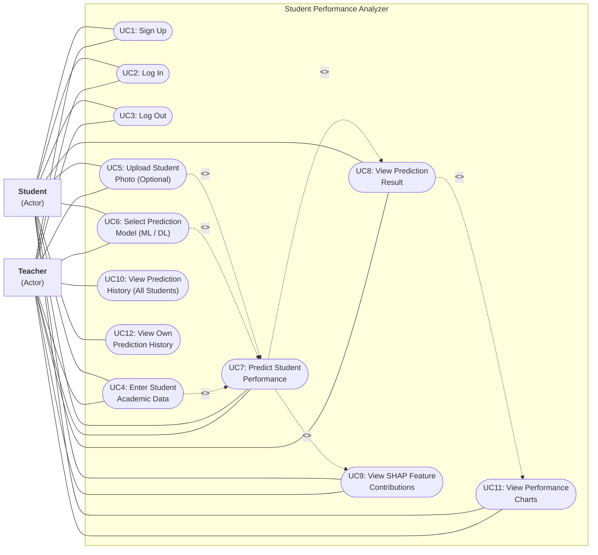

# Use Case Diagram

## Description

The Use Case Diagram shows all interactions between the Teacher and Student actors and the Student Performance Analyzer system. It identifies use cases covering authentication, data entry, prediction, and history review, including role-based access to prediction history.

## Diagram

```mermaid
flowchart LR
    Teacher["<b>Teacher</b>\n(Actor)"]
    Student["<b>Student</b>\n(Actor)"]

    subgraph System["Student Performance Analyzer"]
        UC1(["UC1: Sign Up"])
        UC2(["UC2: Log In"])
        UC3(["UC3: Log Out"])
        UC4(["UC4: Enter Student\nAcademic Data"])
        UC5(["UC5: Upload Student\nPhoto (Optional)"])
        UC6(["UC6: Select Prediction\nModel (ML / DL)"])
        UC7(["UC7: Predict Student\nPerformance"])
        UC8(["UC8: View Prediction\nResult"])
        UC9(["UC9: View SHAP Feature\nContributions"])
        UC10(["UC10: View Prediction\nHistory (All Students)"])
        UC12(["UC12: View Own\nPrediction History"])
        UC11(["UC11: View Performance\nCharts"])
    end

    %% Teacher associations
    Teacher --- UC1
    Teacher --- UC2
    Teacher --- UC3
    Teacher --- UC4
    Teacher --- UC5
    Teacher --- UC6
    Teacher --- UC7
    Teacher --- UC8
    Teacher --- UC9
    Teacher --- UC10
    Teacher --- UC11

    %% Student associations
    Student --- UC1
    Student --- UC2
    Student --- UC3
    Student --- UC4
    Student --- UC5
    Student --- UC6
    Student --- UC7
    Student --- UC8
    Student --- UC9
    Student --- UC12
    Student --- UC11

    %% Dependencies
    UC4 -.->|"<<include>>"| UC7
    UC6 -.->|"<<include>>"| UC7
    UC5 -.->|"<<extend>>"| UC7
    UC7 -.->|"<<include>>"| UC8
    UC7 -.->|"<<include>>"| UC9
    UC8 -.->|"<<include>>"| UC11
```

## Use Case Specifications

### UC1: Sign Up

| Field | Description |
|-------|-------------|
| **Actor** | Teacher / Student |
| **Precondition** | User does not have an existing account |
| **Main Flow** | 1. User opens the application. 2. Selects role (Teacher/Student) and clicks "Sign Up" tab. 3. Enters name (optional), email, and password. 4. System validates input and creates account. 5. System issues JWT token (with role claim) and redirects to main interface |
| **Postcondition** | Teacher/student account is created in the database; user is logged in |
| **Alternate Flow** | If email already exists, system shows error "Email already registered" |

### UC2: Log In

| Field | Description |
|-------|-------------|
| **Actor** | Teacher / Student |
| **Precondition** | User has an existing account |
| **Main Flow** | 1. User opens the application. 2. Selects role (Teacher/Student). 3. Enters email and password. 4. System verifies credentials against stored hash. 5. System issues JWT token (with role claim) and redirects to main interface |
| **Postcondition** | User is authenticated; JWT token stored in browser |
| **Alternate Flow** | If credentials are invalid, system shows error "Invalid email or password" |

### UC3: Log Out

| Field | Description |
|-------|-------------|
| **Actor** | Teacher / Student |
| **Precondition** | User is logged in |
| **Main Flow** | 1. User clicks "Log Out" button. 2. System removes JWT token from localStorage. 3. UI returns to login screen |
| **Postcondition** | User session is ended; token is cleared |

### UC4: Enter Student Academic Data

| Field | Description |
|-------|-------------|
| **Actor** | Teacher / Student |
| **Precondition** | User is logged in |
| **Main Flow** | 1. User navigates to "Predict" tab. 2. Enters student name, age (15-30), and department. 3. Adds semester data (1-8 semesters): semester number, internal marks (0-300), university marks (0-300), attendance (0-100%). 4. Can add or remove semesters as needed |
| **Postcondition** | Student data is ready for prediction |
| **Validation** | Age must be 15-30. Marks must be 0-300. Attendance must be 0-100%. At least 1 semester required |

### UC5: Upload Student Photo (Optional)

| Field | Description |
|-------|-------------|
| **Actor** | Teacher / Student |
| **Precondition** | User is entering student data |
| **Main Flow** | 1. User optionally attaches a student photo via file upload. 2. Photo is sent as multipart form data. 3. System stores photo as BLOB in database |
| **Postcondition** | Photo is associated with the prediction record |

### UC6: Select Prediction Model

| Field | Description |
|-------|-------------|
| **Actor** | Teacher / Student |
| **Precondition** | User is on the prediction form |
| **Main Flow** | 1. User selects either "ML (Random Forest)" or "DL (Neural Network)" from dropdown. 2. Selection is included in the prediction request |
| **Postcondition** | Model type is set for the upcoming prediction |

### UC7: Predict Student Performance

| Field | Description |
|-------|-------------|
| **Actor** | Teacher / Student |
| **Precondition** | Student data is entered (UC4) and model is selected (UC6) |
| **Main Flow** | 1. User clicks "Predict" button. 2. System constructs 25-feature vector from student data. 3. System scales features and runs inference using selected model. 4. System computes SHAP explanations. 5. System applies rule-based override if applicable. 6. System stores prediction record in database (if requester is a student, the record is stored with `student_id` ownership). 7. Result is displayed to the user |
| **Postcondition** | Prediction is generated, stored, and displayed |

### UC8: View Prediction Result

| Field | Description |
|-------|-------------|
| **Actor** | Teacher / Student |
| **Precondition** | Prediction has been generated (UC7) |
| **Main Flow** | 1. System displays prediction label with color-coded badge (Green=Good, Yellow=Average, Red=Needs Attention). 2. Shows confidence percentage. 3. Shows which model was used (and whether rule override was applied) |
| **Postcondition** | User sees the prediction outcome |

### UC9: View SHAP Feature Contributions

| Field | Description |
|-------|-------------|
| **Actor** | Teacher / Student |
| **Precondition** | Prediction has been generated (UC7) |
| **Main Flow** | 1. System displays a bar chart showing top feature contributions. 2. Each bar shows feature name, its value, and contribution magnitude. 3. Positive contributions push toward the predicted class; negative push away |
| **Postcondition** | User understands which factors most influenced the prediction |

### UC10: View Prediction History

| Field | Description |
|-------|-------------|
| **Actor** | Teacher |
| **Precondition** | Teacher is logged in |
| **Main Flow** | 1. Teacher clicks "History" tab. 2. System fetches past prediction records from database. 3. Displays a table with columns: Student Name, Department, Age, Prediction, Confidence, Model Used, Avg %, Attendance, Date. 4. Records are sorted by newest first |
| **Postcondition** | Teacher can review all past predictions (including student-owned records) |

### UC12: View Own Prediction History

| Field | Description |
|-------|-------------|
| **Actor** | Student |
| **Precondition** | Student is logged in |
| **Main Flow** | 1. Student clicks "History" tab. 2. System fetches past prediction records owned by the logged-in student. 3. Displays the same table layout as teacher history, but scoped to the student. 4. Records are sorted by newest first |
| **Postcondition** | Student can review only their own past predictions |
| **Alternate Flow** | If the student has no records, the system displays "No history yet" |

### UC11: View Performance Charts

| Field | Description |
|-------|-------------|
| **Actor** | Teacher |
| **Precondition** | Prediction result is displayed (UC8) |
| **Main Flow** | 1. System renders interactive charts using Recharts library. 2. Shows semester-wise performance trends. 3. Displays feature contribution visualization |
| **Postcondition** | Teacher has a visual understanding of student performance patterns |
