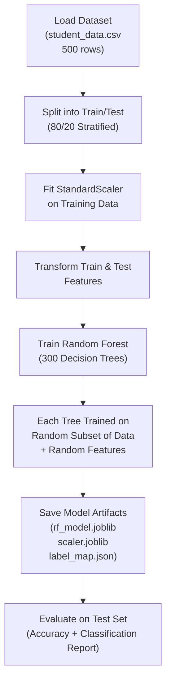
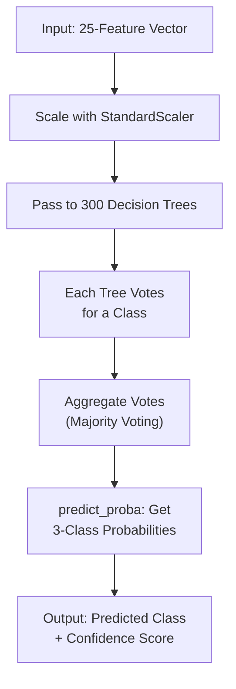
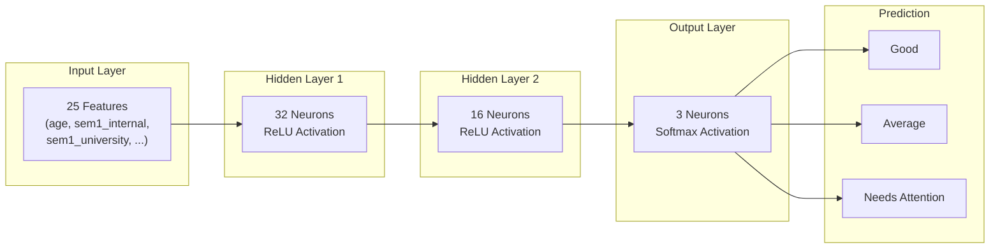
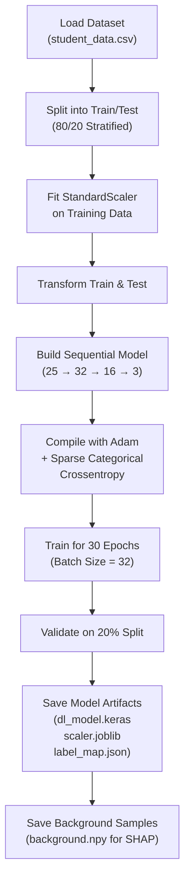
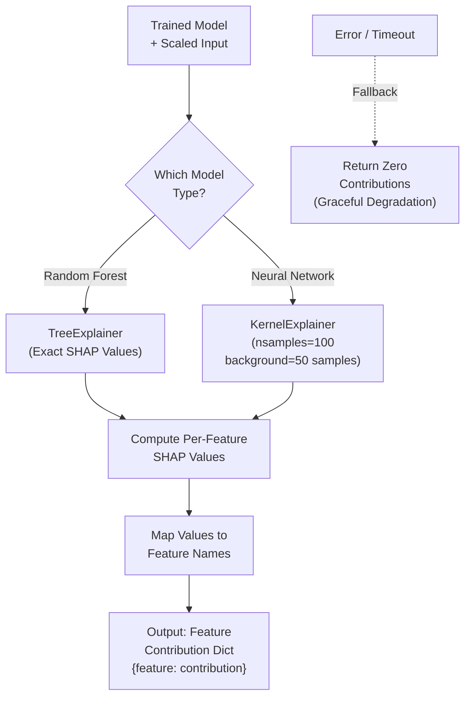
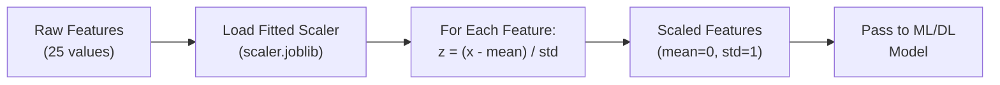
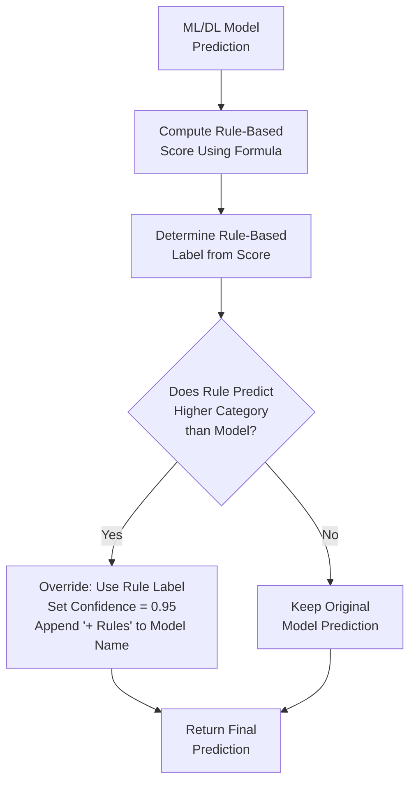

# Algorithms Used

## Description

The Student Performance Analyzer employs multiple algorithms for prediction, explainability, preprocessing, and decision-making. This document describes each algorithm with its configuration, purpose, and flowchart.

---

## 1. Random Forest Classifier

### Overview

Random Forest is an ensemble machine learning algorithm that builds multiple decision trees during training and outputs the class with the majority vote across all trees.

### Configuration

| Parameter | Value | Purpose |
|-----------|-------|---------|
| `n_estimators` | 300 | Number of decision trees in the ensemble |
| `class_weight` | balanced | Adjusts weights to handle class imbalance |
| `random_state` | 42 | Ensures reproducible results |
| Train/Test Split | 80/20 | Stratified split preserving class distribution |

### Training Flowchart



### Inference Flowchart



### Feature Input (25 Features)
`age`, `sem1_internal`, `sem1_university`, `sem1_attendance`, `sem2_internal`, ..., `sem8_attendance`

---

## 2. Feed-Forward Neural Network

### Overview

A deep learning model using a fully-connected feed-forward architecture with ReLU activation in hidden layers and Softmax output for multi-class classification.

### Architecture

| Layer | Type | Units | Activation | Purpose |
|-------|------|-------|------------|---------|
| Input | Input | 25 | — | Accepts 25 scaled features |
| Hidden 1 | Dense | 32 | ReLU | Learn non-linear patterns |
| Hidden 2 | Dense | 16 | ReLU | Learn higher-level representations |
| Output | Dense | 3 | Softmax | Probability distribution over 3 classes |

### Training Configuration

| Parameter | Value |
|-----------|-------|
| Optimizer | Adam (learning_rate = 0.001) |
| Loss Function | Sparse Categorical Crossentropy |
| Epochs | 30 |
| Batch Size | 32 |
| Validation Split | 20% |

### Architecture Diagram



### Training Flowchart



---

## 3. SHAP (SHapley Additive exPlanations)

### Overview

SHAP provides model-agnostic explanations by computing the contribution of each feature to a specific prediction. It is based on Shapley values from cooperative game theory.

### Two Explainer Types

| Explainer | Used For | Method | Speed |
|-----------|----------|--------|-------|
| **TreeExplainer** | Random Forest | Exact computation using tree structure | Fast |
| **KernelExplainer** | Neural Network | Model-agnostic approximation | Slower (capped at 100 samples, 50 background) |

### SHAP Explanation Flowchart



### Example Output
```
Feature: sem8_university → Contribution: +0.35 (pushes toward "Good")
Feature: sem1_attendance → Contribution: -0.12 (pushes away from "Good")
Feature: age            → Contribution: +0.02 (minor positive effect)
```

---

## 4. StandardScaler (Feature Normalization)

### Overview

StandardScaler standardizes features by removing the mean and scaling to unit variance. This ensures all features contribute equally to the model regardless of their original scale.

### Formula

```
z = (x - μ) / σ
```

Where `μ` is the mean and `σ` is the standard deviation of each feature from the training data.

### Why It Matters

| Feature | Raw Range | After Scaling |
|---------|-----------|---------------|
| age | 15 – 30 | ~ -1.5 to +1.5 |
| sem_internal | 0 – 300 | ~ -3.0 to +3.0 |
| sem_attendance | 0 – 100 | ~ -2.5 to +2.5 |

Without scaling, features with larger ranges (like marks 0-300) would dominate over features with smaller ranges (like age 15-30).

### Scaling Flowchart



---

## 5. Hybrid Rule-Based Override

### Overview

After the ML/DL model produces a prediction, a rule-based system computes an independent score using a weighted formula. If the rule-based prediction is **higher** (more favorable) than the model's prediction, it overrides the model output. This prevents the model from being too pessimistic.

### Score Formula

```
score = 0.55 × avg_percentage + 0.25 × last_percentage + 0.20 × avg_attendance + (age - 20) × 0.5
```

### Classification Thresholds

| Score Range | Label |
|-------------|-------|
| score >= 75 | Good |
| score >= 55 | Average |
| score < 55 | Needs Attention |

### Override Logic Flowchart



### Override Examples

| Model Prediction | Rule Score | Rule Label | Action | Final Output |
|-----------------|------------|------------|--------|--------------|
| Needs Attention | 62 | Average | Override ↑ | Average (+ Rules) |
| Average | 80 | Good | Override ↑ | Good (+ Rules) |
| Good | 50 | Needs Attention | Keep | Good |
| Average | 60 | Average | Keep | Average |

> **Key Principle:** The rule override can only **upgrade** a prediction (Needs Attention → Average, Average → Good), never downgrade it. This ensures the system errs on the side of giving students a positive assessment when the data supports it.
