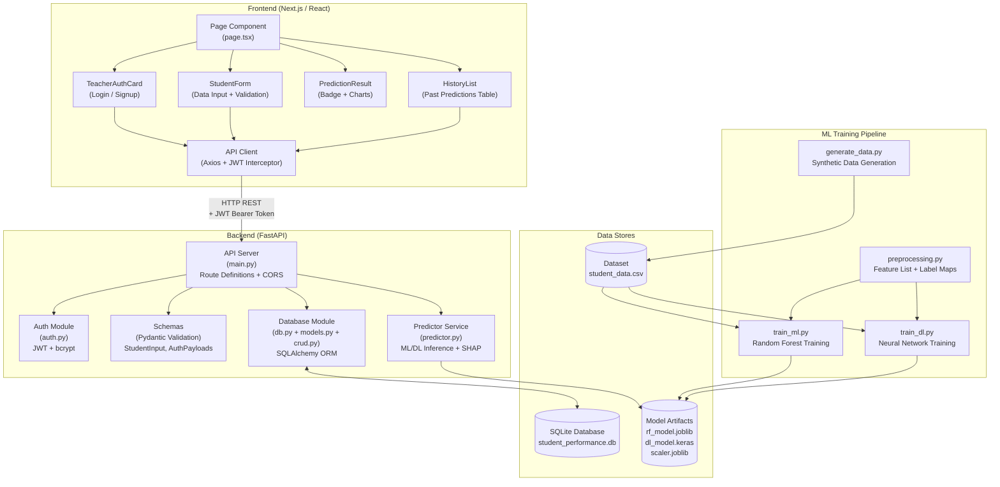
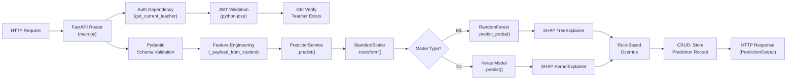

# Module Design

## Description

The Student Performance Analyzer is organized into distinct modules, each with a specific responsibility. This document shows the module architecture, dependencies between modules, and the internal structure of the backend.

---

## System Module Architecture

---

## Module Descriptions

### Frontend Modules

| Module | File(s) | Responsibility |
|--------|---------|----------------|
| **Page Component** | `frontend/src/app/page.tsx` | Root application component. Manages authentication state, tab navigation (Predict/History), and logout |
| **TeacherAuthCard** | `frontend/src/components/TeacherAuthCard.tsx` | Login and signup forms with Zod validation. Calls auth API endpoints |
| **StudentForm** | `frontend/src/components/StudentForm.tsx` | Multi-step form for student data entry. Manages dynamic semester list (add/remove). Validates all constraints (age 15-30, marks 0-300, attendance 0-100). Triggers prediction API call |
| **PredictionResult** | `frontend/src/components/PredictionResult.tsx` | Displays prediction outcome: color-coded badge, confidence percentage, SHAP feature contribution charts (Recharts) |
| **HistoryList** | `frontend/src/components/HistoryList.tsx` | Fetches and displays past predictions in a table with sorting by date |
| **API Client** | `frontend/src/lib/api.ts` | Axios instance with JWT Bearer token interceptor. Handles 401 responses by clearing token and triggering logout |

### Backend Modules

| Module | File(s) | Responsibility |
|--------|---------|----------------|
| **API Server** | `backend/app/main.py` | FastAPI application entry point. Defines all REST endpoints, CORS configuration, startup initialization, rule-based override logic, and feature vector construction |
| **Auth Module** | `backend/app/auth.py` | Password hashing (bcrypt via passlib), password verification, JWT token creation (python-jose, HS256, 24h expiry), and token validation dependency |
| **Schemas** | `backend/app/schemas/student.py`, `backend/app/schemas/auth.py` | Pydantic request/response models: `StudentInput`, `SemesterInput`, `PredictionOutput`, `TeacherSignup`, `TeacherLogin`, `TokenResponse` |
| **Predictor Service** | `backend/app/services/predictor.py` | Core ML/DL engine. Lazy-loads model artifacts. Handles feature scaling, model inference (RF predict_proba / Keras predict), and SHAP explanation generation |
| **Database Module** | `backend/app/database/db.py`, `models.py`, `crud.py` | SQLAlchemy engine and session factory, ORM models (Teacher, PredictionRecord), CRUD operations (create/list prediction records, photo management) |

### Training Pipeline Modules

| Module | File(s) | Responsibility |
|--------|---------|----------------|
| **RF Training** | `backend/ml/train_ml.py` | Loads dataset, splits, fits scaler, trains RandomForestClassifier, saves all artifacts |
| **NN Training** | `backend/ml/train_dl.py` | Loads dataset, splits, fits scaler, builds Keras Sequential model, trains for 30 epochs, saves all artifacts + background samples |
| **Preprocessing** | `backend/ml/preprocessing.py` | Defines the 25-feature list and integer-to-label mappings used by both training scripts |
| **Data Generation** | `backend/data/generate_data.py` | Generates synthetic student data (500 rows) with normal distributions and rule-based labeling |

---

## Backend Internal Component Flow

---

## Module Communication Protocols

| From | To | Protocol | Data Format |
|------|----|----------|-------------|
| Frontend | Backend | HTTP REST | JSON (with JWT Bearer header) |
| Backend | SQLite | SQLAlchemy ORM | SQL queries via session |
| Backend | Model Artifacts | File I/O | joblib (RF, Scaler), Keras HDF5 (NN), JSON (labels), NumPy (background) |
| Training Scripts | Model Artifacts | File I/O | Same as above (write during training) |
| Training Scripts | Dataset | File I/O | CSV (pandas read/write) |
