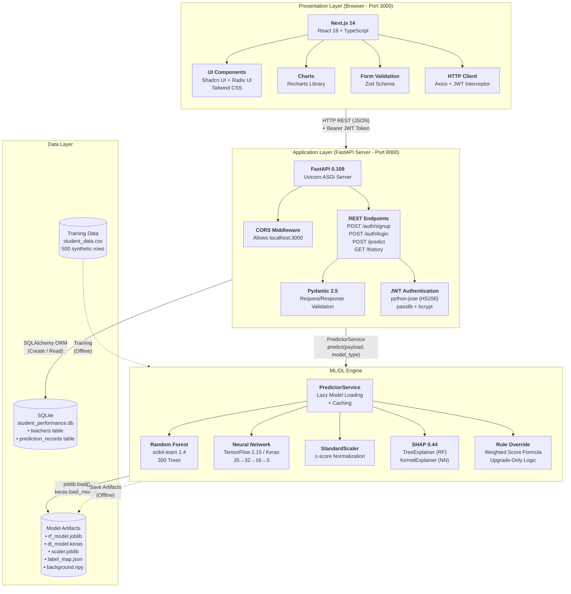

# System Architecture Diagram

## Description

The Student Performance Analyzer follows a 4-tier architecture: Presentation Layer (browser), Application Layer (API server), ML/DL Engine, and Data Layer. This document shows how these tiers interact and the technologies used at each level.

## Architecture Diagram



## Technology Stack Summary

| Layer | Technologies | Purpose |
|-------|-------------|---------|
| **Presentation** | Next.js 14, React 18, TypeScript, Tailwind CSS, Shadcn UI, Recharts, Axios, Zod | User interface, form handling, chart rendering, API communication |
| **Application** | FastAPI, Uvicorn, Pydantic, python-jose, passlib/bcrypt | REST API server, request validation, JWT authentication |
| **ML/DL Engine** | scikit-learn, TensorFlow/Keras, SHAP, NumPy, Pandas | Model inference, feature scaling, explainability, rule override |
| **Data** | SQLite, SQLAlchemy, joblib, Keras HDF5 | Persistent storage, ORM, model serialization |

## Communication Flow

```
┌─────────────┐       HTTPS/JSON        ┌──────────────┐
│   Browser    │ ◄───────────────────► │  FastAPI      │
│  (Port 3000) │   + JWT Bearer Token   │  (Port 8000)  │
│   Next.js    │                         │  Uvicorn      │
└─────────────┘                         └──────┬───────┘
                                                │
                            ┌───────────────────┼───────────────────┐
                            │                   │                   │
                    ┌───────▼──────┐    ┌──────▼───────┐   ┌──────▼──────┐
                    │  Auth Module │    │  Predictor   │   │  Database   │
                    │  JWT+bcrypt  │    │  Service     │   │  Module     │
                    └──────────────┘    │  RF/NN/SHAP  │   │  SQLAlchemy │
                                        └──────┬───────┘   └──────┬──────┘
                                               │                   │
                                        ┌──────▼───────┐   ┌──────▼──────┐
                                        │ Model Files  │   │   SQLite    │
                                        │ .joblib      │   │    .db      │
                                        │ .keras       │   └─────────────┘
                                        └──────────────┘
```

## Deployment Configuration

| Component | Host | Port | Command |
|-----------|------|------|---------|
| Frontend | localhost | 3000 | `npm run dev` |
| Backend | localhost | 8000 | `uvicorn app.main:app --reload` |
| Database | localhost | — | Embedded SQLite (file-based) |
