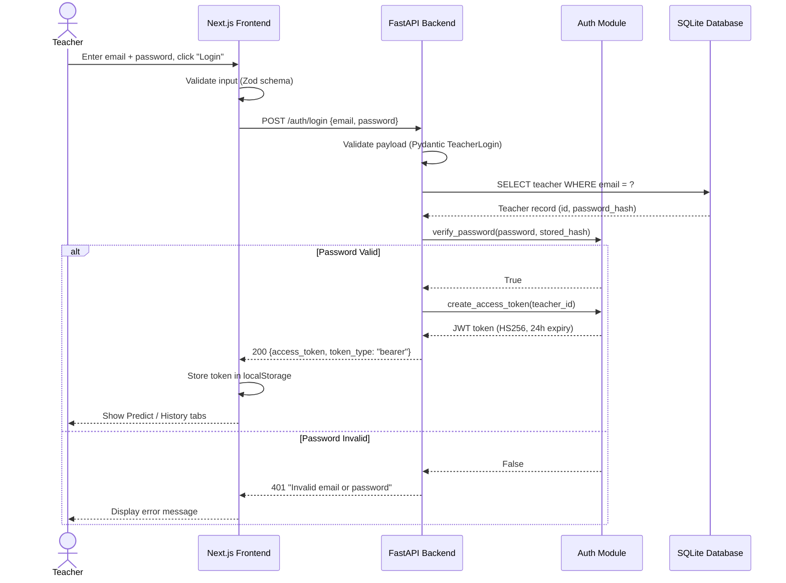
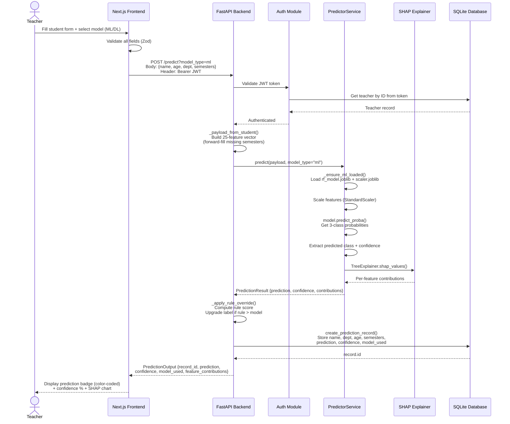
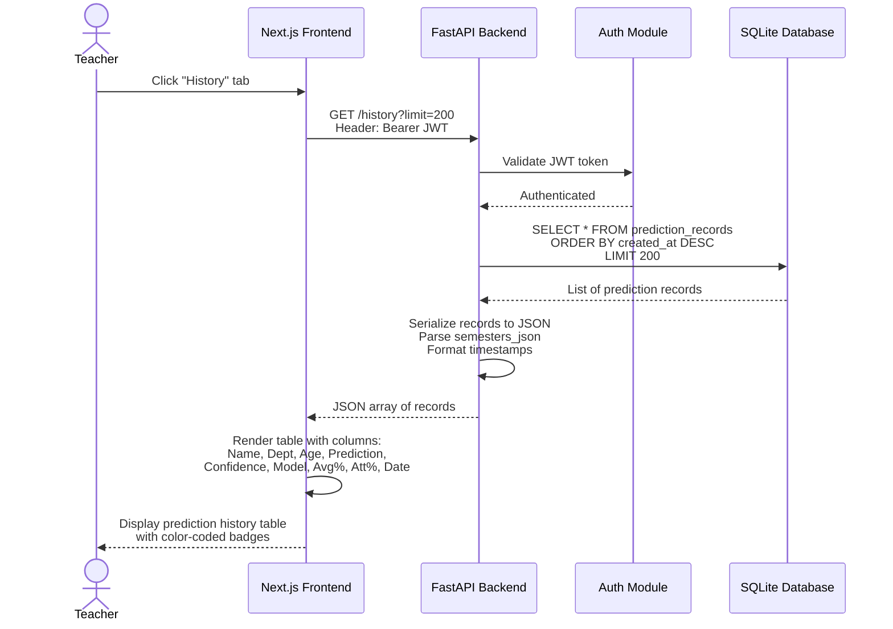
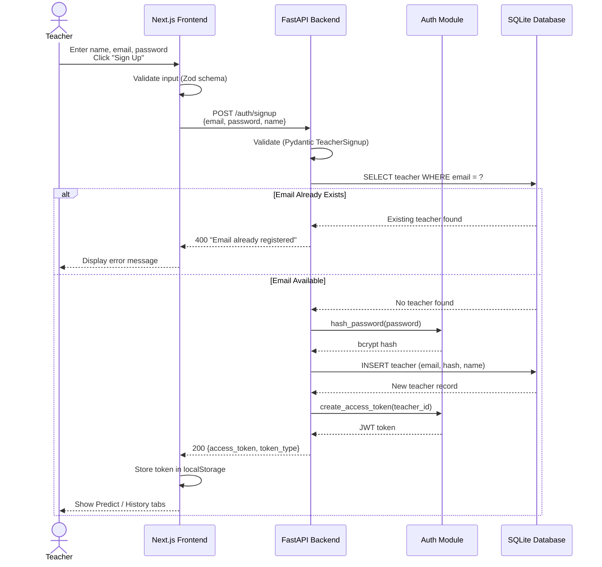

# Sequence Diagrams

## Description

Sequence diagrams show the step-by-step interactions between components for the three main operations: Teacher Login, Student Performance Prediction, and Prediction History Retrieval.

---

## 1. Teacher Login Flow

---

## 2. Student Performance Prediction Flow

---

## 3. View Prediction History Flow

---

## 4. Teacher Sign Up Flow

