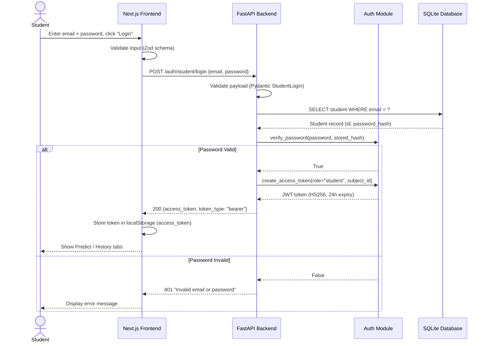
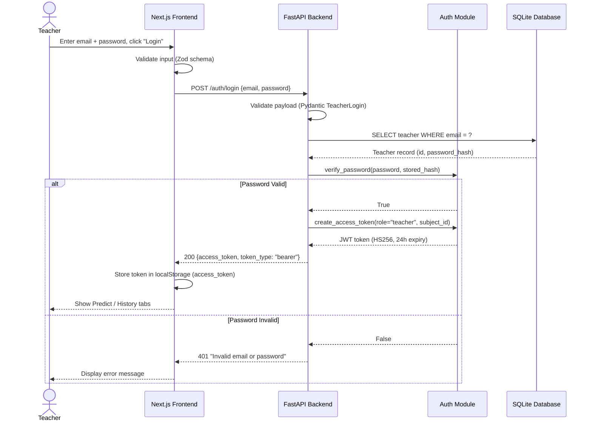
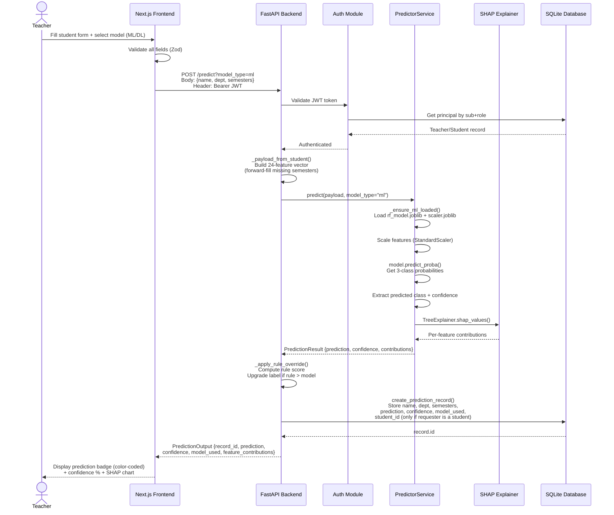
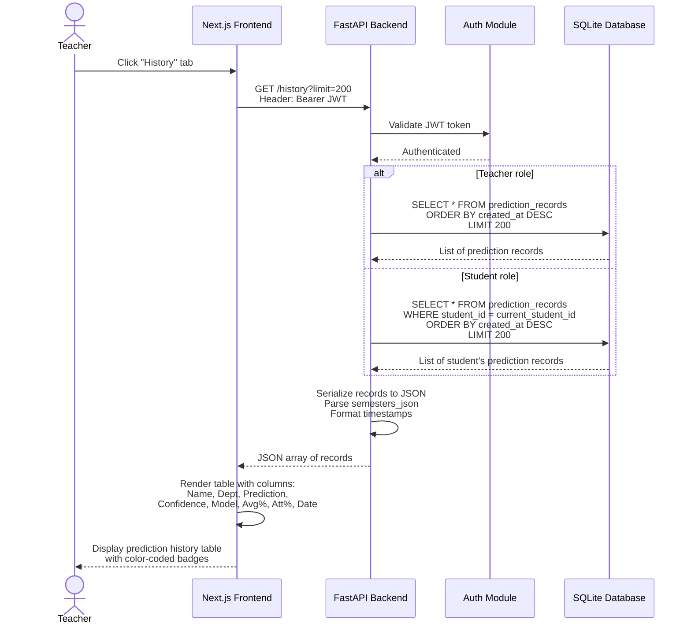
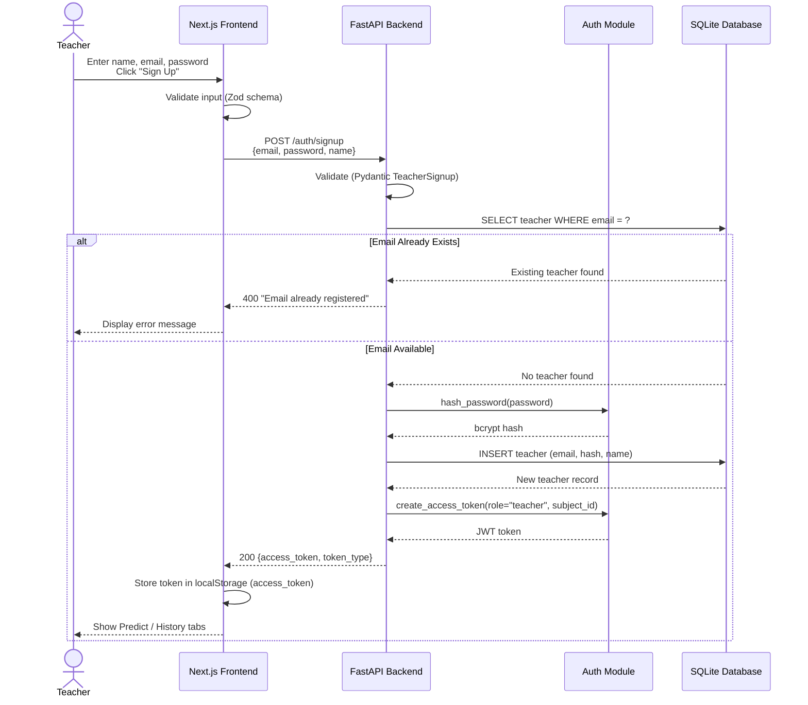
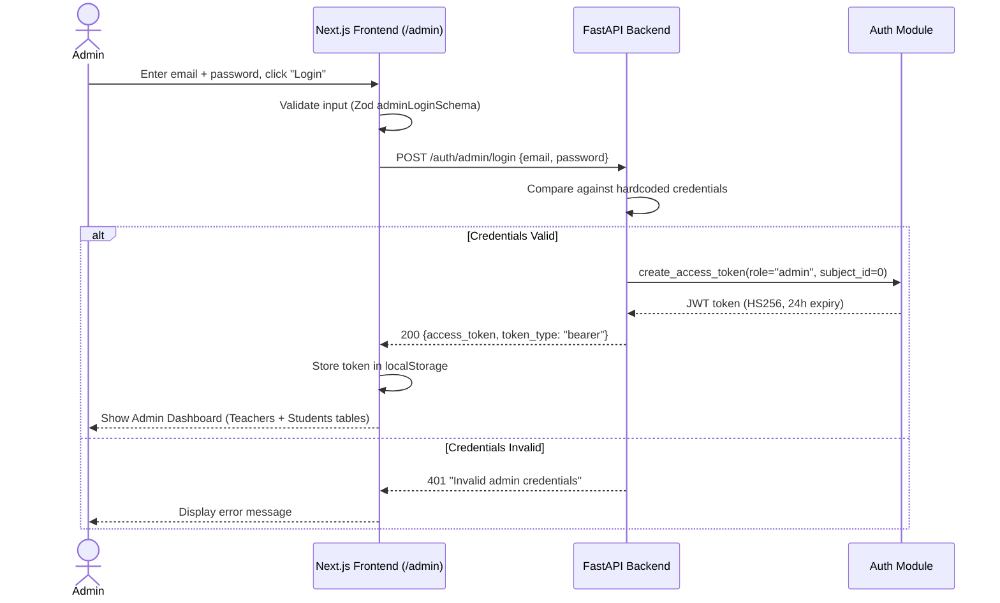
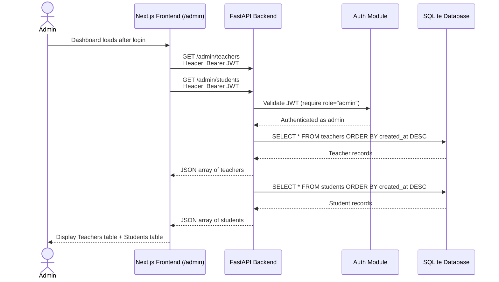

# Sequence Diagrams

## Description

Sequence diagrams show the step-by-step interactions between components for the main operations: Teacher/Student Login, Student Performance Prediction, and Prediction History Retrieval with role-based access.

---

## 1.1 Student Login Flow

```mermaid
sequenceDiagram
    actor Student
    participant Frontend as Next.js Frontend
    participant Backend as FastAPI Backend
    participant Auth as Auth Module
    participant DB as SQLite Database

    Student->>Frontend: Enter email + password, click "Login"
    Frontend->>Frontend: Validate input (Zod schema)
    Frontend->>Backend: POST /auth/student/login {email, password}
    Backend->>Backend: Validate payload (Pydantic StudentLogin)
    Backend->>DB: SELECT student WHERE email = ?
    DB-->>Backend: Student record (id, password_hash)
    Backend->>Auth: verify_password(password, stored_hash)

    alt Password Valid
        Auth-->>Backend: True
        Backend->>Auth: create_access_token(role="student", subject_id)
        Auth-->>Backend: JWT token (HS256, 24h expiry)
        Backend-->>Frontend: 200 {access_token, token_type: "bearer"}
        Frontend->>Frontend: Store token in localStorage (access_token)
        Frontend-->>Student: Show Predict / History tabs
    else Password Invalid
        Auth-->>Backend: False
        Backend-->>Frontend: 401 "Invalid email or password"
        Frontend-->>Student: Display error message
    end
```

## 1. Teacher Login Flow

```mermaid
sequenceDiagram
    actor Teacher
    participant Frontend as Next.js Frontend
    participant Backend as FastAPI Backend
    participant Auth as Auth Module
    participant DB as SQLite Database

    Teacher->>Frontend: Enter email + password, click "Login"
    Frontend->>Frontend: Validate input (Zod schema)
    Frontend->>Backend: POST /auth/login {email, password}
    Backend->>Backend: Validate payload (Pydantic TeacherLogin)
    Backend->>DB: SELECT teacher WHERE email = ?
    DB-->>Backend: Teacher record (id, password_hash)
    Backend->>Auth: verify_password(password, stored_hash)

    alt Password Valid
        Auth-->>Backend: True
        Backend->>Auth: create_access_token(role="teacher", subject_id)
        Auth-->>Backend: JWT token (HS256, 24h expiry)
        Backend-->>Frontend: 200 {access_token, token_type: "bearer"}
        Frontend->>Frontend: Store token in localStorage (access_token)
        Frontend-->>Teacher: Show Predict / History tabs
    else Password Invalid
        Auth-->>Backend: False
        Backend-->>Frontend: 401 "Invalid email or password"
        Frontend-->>Teacher: Display error message
    end
```

---

## 2. Student Performance Prediction Flow

```mermaid
sequenceDiagram
    actor Teacher
    participant Frontend as Next.js Frontend
    participant Backend as FastAPI Backend
    participant Auth as Auth Module
    participant Predictor as PredictorService
    participant SHAP as SHAP Explainer
    participant DB as SQLite Database

    Teacher->>Frontend: Fill student form + select model (ML/DL)
    Frontend->>Frontend: Validate all fields (Zod)
    Frontend->>Backend: POST /predict?model_type=ml<br/>Body: {name, dept, semesters}<br/>Header: Bearer JWT

    Backend->>Auth: Validate JWT token
    Auth->>DB: Get principal by sub+role
    DB-->>Auth: Teacher/Student record
    Auth-->>Backend: Authenticated

    Backend->>Backend: _payload_from_student()<br/>Build 24-feature vector<br/>(forward-fill missing semesters)

    Backend->>Predictor: predict(payload, model_type="ml")
    Predictor->>Predictor: _ensure_ml_loaded()<br/>Load rf_model.joblib + scaler.joblib
    Predictor->>Predictor: Scale features (StandardScaler)
    Predictor->>Predictor: model.predict_proba()<br/>Get 3-class probabilities
    Predictor->>Predictor: Extract predicted class + confidence

    Predictor->>SHAP: TreeExplainer.shap_values()
    SHAP-->>Predictor: Per-feature contributions

    Predictor-->>Backend: PredictionResult {prediction, confidence, contributions}

    Backend->>Backend: _apply_rule_override()<br/>Compute rule score<br/>Upgrade label if rule > model

    Backend->>DB: create_prediction_record()<br/>Store name, dept, semesters,<br/>prediction, confidence, model_used,<br/>student_id (only if requester is a student)

    DB-->>Backend: record.id

    Backend-->>Frontend: PredictionOutput {record_id, prediction,<br/>confidence, model_used, feature_contributions}

    Frontend-->>Teacher: Display prediction badge (color-coded)<br/>+ confidence % + SHAP chart
```

---

## 3. View Prediction History Flow

```mermaid
sequenceDiagram
    actor Teacher
    participant Frontend as Next.js Frontend
    participant Backend as FastAPI Backend
    participant Auth as Auth Module
    participant DB as SQLite Database

    Teacher->>Frontend: Click "History" tab
    Frontend->>Backend: GET /history?limit=200<br/>Header: Bearer JWT

    Backend->>Auth: Validate JWT token
    Auth-->>Backend: Authenticated

    alt Teacher role
        Backend->>DB: SELECT * FROM prediction_records<br/>ORDER BY created_at DESC<br/>LIMIT 200
        DB-->>Backend: List of prediction records
    else Student role
        Backend->>DB: SELECT * FROM prediction_records<br/>WHERE student_id = current_student_id<br/>ORDER BY created_at DESC<br/>LIMIT 200
        DB-->>Backend: List of student's prediction records
    end

    Backend->>Backend: Serialize records to JSON<br/>Parse semesters_json<br/>Format timestamps

    Backend-->>Frontend: JSON array of records

    Frontend->>Frontend: Render table with columns:<br/>Name, Dept, Prediction,<br/>Confidence, Model, Avg%, Att%, Date

    Frontend-->>Teacher: Display prediction history table<br/>with color-coded badges
```

---

## 4. Teacher Sign Up Flow

```mermaid
sequenceDiagram
    actor Teacher
    participant Frontend as Next.js Frontend
    participant Backend as FastAPI Backend
    participant Auth as Auth Module
    participant DB as SQLite Database

    Teacher->>Frontend: Enter name, email, password<br/>Click "Sign Up"
    Frontend->>Frontend: Validate input (Zod schema)
    Frontend->>Backend: POST /auth/signup<br/>{email, password, name}
    Backend->>Backend: Validate (Pydantic TeacherSignup)
    Backend->>DB: SELECT teacher WHERE email = ?

    alt Email Already Exists
        DB-->>Backend: Existing teacher found
        Backend-->>Frontend: 400 "Email already registered"
        Frontend-->>Teacher: Display error message
    else Email Available
        DB-->>Backend: No teacher found
        Backend->>Auth: hash_password(password)
        Auth-->>Backend: bcrypt hash
        Backend->>DB: INSERT teacher (email, hash, name)
        DB-->>Backend: New teacher record
        Backend->>Auth: create_access_token(role="teacher", subject_id)
        Auth-->>Backend: JWT token
        Backend-->>Frontend: 200 {access_token, token_type}
        Frontend->>Frontend: Store token in localStorage (access_token)
        Frontend-->>Teacher: Show Predict / History tabs
    end
```

---

## 5. Admin Login Flow

```mermaid
sequenceDiagram
    actor Admin
    participant Frontend as Next.js Frontend (/admin)
    participant Backend as FastAPI Backend
    participant Auth as Auth Module

    Admin->>Frontend: Enter email + password, click "Login"
    Frontend->>Frontend: Validate input (Zod adminLoginSchema)
    Frontend->>Backend: POST /auth/admin/login {email, password}
    Backend->>Backend: Compare against hardcoded credentials

    alt Credentials Valid
        Backend->>Auth: create_access_token(role="admin", subject_id=0)
        Auth-->>Backend: JWT token (HS256, 24h expiry)
        Backend-->>Frontend: 200 {access_token, token_type: "bearer"}
        Frontend->>Frontend: Store token in localStorage
        Frontend-->>Admin: Show Admin Dashboard (Teachers + Students tables)
    else Credentials Invalid
        Backend-->>Frontend: 401 "Invalid admin credentials"
        Frontend-->>Admin: Display error message
    end
```

---

## 6. Admin View Users Flow

```mermaid
sequenceDiagram
    actor Admin
    participant Frontend as Next.js Frontend (/admin)
    participant Backend as FastAPI Backend
    participant Auth as Auth Module
    participant DB as SQLite Database

    Admin->>Frontend: Dashboard loads after login
    Frontend->>Backend: GET /admin/teachers<br/>Header: Bearer JWT
    Frontend->>Backend: GET /admin/students<br/>Header: Bearer JWT

    Backend->>Auth: Validate JWT (require role="admin")
    Auth-->>Backend: Authenticated as admin

    Backend->>DB: SELECT * FROM teachers ORDER BY created_at DESC
    DB-->>Backend: Teacher records
    Backend-->>Frontend: JSON array of teachers

    Backend->>DB: SELECT * FROM students ORDER BY created_at DESC
    DB-->>Backend: Student records
    Backend-->>Frontend: JSON array of students

    Frontend-->>Admin: Display Teachers table + Students table
```
