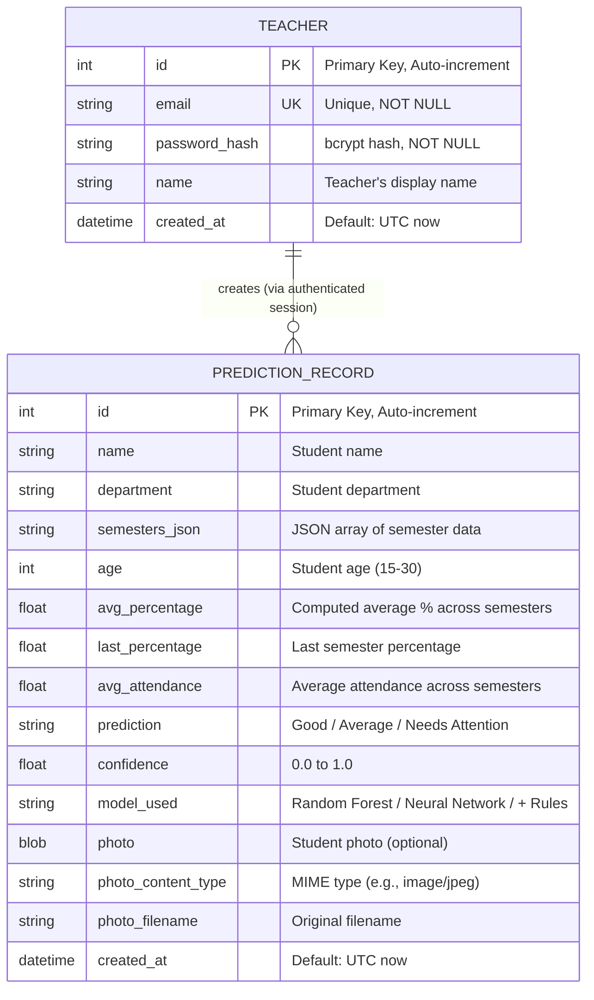

# Entity-Relationship Diagram

## Description

The ER Diagram shows the database schema of the Student Performance Analyzer. The system uses SQLite with two tables: `teachers` (for authentication) and `prediction_records` (for storing prediction results).

## ER Diagram



## Table Details

### teachers

| Column | Type | Constraints | Description |
|--------|------|-------------|-------------|
| `id` | INTEGER | PRIMARY KEY, AUTO-INCREMENT | Unique teacher identifier |
| `email` | STRING | UNIQUE, NOT NULL | Teacher's email address (used for login) |
| `password_hash` | STRING | NOT NULL | bcrypt-hashed password |
| `name` | STRING | NULLABLE | Teacher's display name |
| `created_at` | DATETIME | DEFAULT utcnow | Account creation timestamp |

### prediction_records

| Column | Type | Constraints | Description |
|--------|------|-------------|-------------|
| `id` | INTEGER | PRIMARY KEY, AUTO-INCREMENT | Unique record identifier |
| `name` | STRING | NULLABLE | Student's name |
| `department` | STRING | NULLABLE | Student's department |
| `semesters_json` | STRING | NULLABLE | JSON-encoded array of semester data (internal_marks, university_marks, attendance per semester) |
| `age` | INTEGER | NOT NULL | Student's age (15-30) |
| `avg_percentage` | FLOAT | NULLABLE | Computed: average of (internal + university) / 600 * 100 across all semesters |
| `last_percentage` | FLOAT | NULLABLE | Computed: last semester's (internal + university) / 600 * 100 |
| `avg_attendance` | FLOAT | NULLABLE | Computed: average attendance percentage across all semesters |
| `prediction` | STRING | NOT NULL | Model output: "Good", "Average", or "Needs Attention" |
| `confidence` | FLOAT | NOT NULL | Prediction confidence score (0.0 to 1.0) |
| `model_used` | STRING | NOT NULL | Which model was used: "Random Forest", "Neural Network", or with "+ Rules" suffix |
| `photo` | BLOB | NULLABLE | Optional student photo stored as binary data |
| `photo_content_type` | STRING | NULLABLE | MIME type of the photo (e.g., "image/jpeg") |
| `photo_filename` | STRING | NULLABLE | Original filename of the uploaded photo |
| `created_at` | DATETIME | DEFAULT utcnow | Record creation timestamp |

## Relationships

| Relationship | Type | Description |
|-------------|------|-------------|
| Teacher → PredictionRecord | One-to-Many (implicit) | A teacher can create many prediction records. The relationship is enforced via JWT authentication (only authenticated teachers can create records), but there is no explicit foreign key column in the current schema. All authenticated teachers can view all prediction records |

## semesters_json Structure

The `semesters_json` column stores an array of semester objects:

```json
[
  {
    "semester": 1,
    "internal_marks": 210,
    "university_marks": 195,
    "attendance": 82.5
  },
  {
    "semester": 2,
    "internal_marks": 225,
    "university_marks": 200,
    "attendance": 78.0
  }
]
```
