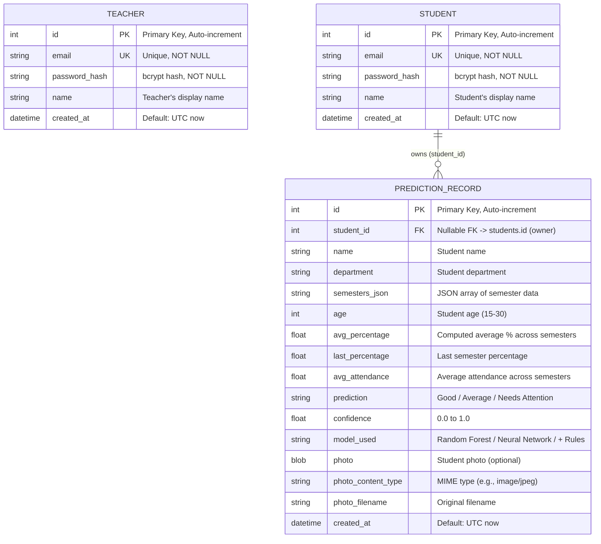

# Entity-Relationship Diagram

## Description

The ER Diagram shows the database schema of the Student Performance Analyzer. The system uses SQLite with three tables: `teachers` (teacher authentication), `students` (student authentication), and `prediction_records` (prediction results and history). Prediction records may optionally be owned by a student via `student_id`.

## ER Diagram


```mermaid
erDiagram
    TEACHER {
        int id PK "Primary Key, Auto-increment"
        string email UK "Unique, NOT NULL"
        string password_hash "bcrypt hash, NOT NULL"
        string name "Teacher's display name"
        datetime created_at "Default: UTC now"
    }

    STUDENT {
        int id PK "Primary Key, Auto-increment"
        string email UK "Unique, NOT NULL"
        string password_hash "bcrypt hash, NOT NULL"
        string name "Student's display name"
        datetime created_at "Default: UTC now"
    }

    PREDICTION_RECORD {
        int id PK "Primary Key, Auto-increment"
        int student_id FK "Nullable FK -> students.id (owner)"
        string name "Student name"
        string department "Student department"
        string semesters_json "JSON array of semester data"
        int age "Student age (15-30)"
        float avg_percentage "Computed average % across semesters"
        float last_percentage "Last semester percentage"
        float avg_attendance "Average attendance across semesters"
        string prediction "Good / Average / Needs Attention"
        float confidence "0.0 to 1.0"
        string model_used "Random Forest / Neural Network / + Rules"
        blob photo "Student photo (optional)"
        string photo_content_type "MIME type (e.g., image/jpeg)"
        string photo_filename "Original filename"
        datetime created_at "Default: UTC now"
    }

    STUDENT ||--o{ PREDICTION_RECORD : "owns (student_id)"
```

## Table Details

### teachers

| Column | Type | Constraints | Description |
|--------|------|-------------|-------------|
| `id` | INTEGER | PRIMARY KEY, AUTO-INCREMENT | Unique teacher identifier |
| `email` | STRING | UNIQUE, NOT NULL | Teacher's email address (used for login) |
| `password_hash` | STRING | NOT NULL | bcrypt-hashed password |
| `name` | STRING | NULLABLE | Teacher's display name |
| `created_at` | DATETIME | DEFAULT utcnow | Account creation timestamp |

### prediction_records

| Column | Type | Constraints | Description |
|--------|------|-------------|-------------|
| `id` | INTEGER | PRIMARY KEY, AUTO-INCREMENT | Unique record identifier |
| `student_id` | INTEGER | NULLABLE, INDEXED | Owner student ID. When present, the record belongs to that student and is visible in the student's history |
| `name` | STRING | NULLABLE | Student's name |
| `department` | STRING | NULLABLE | Student's department |
| `semesters_json` | STRING | NULLABLE | JSON-encoded array of semester data (internal_marks, university_marks, attendance per semester) |
| `age` | INTEGER | NOT NULL | Student's age (15-30) |
| `avg_percentage` | FLOAT | NULLABLE | Computed: average of (internal + university) / 600 * 100 across all semesters |
| `last_percentage` | FLOAT | NULLABLE | Computed: last semester's (internal + university) / 600 * 100 |
| `avg_attendance` | FLOAT | NULLABLE | Computed: average attendance percentage across all semesters |
| `prediction` | STRING | NOT NULL | Model output: "Good", "Average", or "Needs Attention" |
| `confidence` | FLOAT | NOT NULL | Prediction confidence score (0.0 to 1.0) |
| `model_used` | STRING | NOT NULL | Which model was used: "Random Forest", "Neural Network", or with "+ Rules" suffix |
| `photo` | BLOB | NULLABLE | Optional student photo stored as binary data |
| `photo_content_type` | STRING | NULLABLE | MIME type of the photo (e.g., "image/jpeg") |
| `photo_filename` | STRING | NULLABLE | Original filename of the uploaded photo |
| `created_at` | DATETIME | DEFAULT utcnow | Record creation timestamp |

## Relationships

| Relationship | Type | Description |
|-------------|------|-------------|
| Student → PredictionRecord | One-to-Many (FK) | A student can create many prediction records. Ownership is stored via `prediction_records.student_id` |
| Teacher → PredictionRecord | Not modeled as FK | Teachers can create prediction records too, but teacher ownership is not stored as a foreign key. Teachers can view all records; students can only view records where `student_id` matches their account |

## semesters_json Structure

The `semesters_json` column stores an array of semester objects:

```json
[
  {
    "semester": 1,
    "internal_marks": 210,
    "university_marks": 195,
    "attendance": 82.5
  },
  {
    "semester": 2,
    "internal_marks": 225,
    "university_marks": 200,
    "attendance": 78.0
  }
]
```
