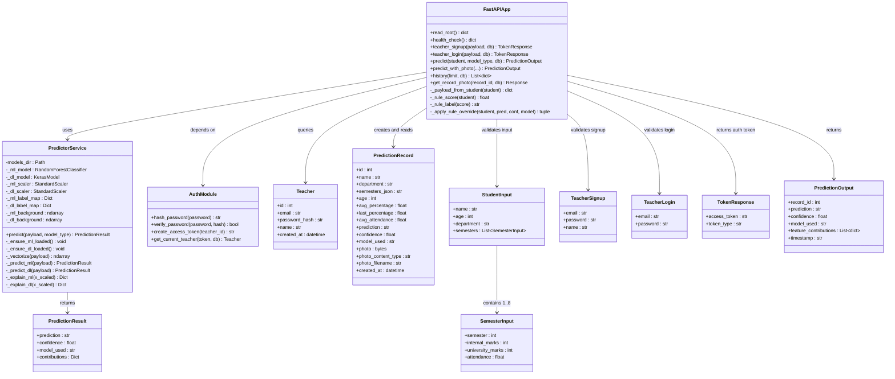
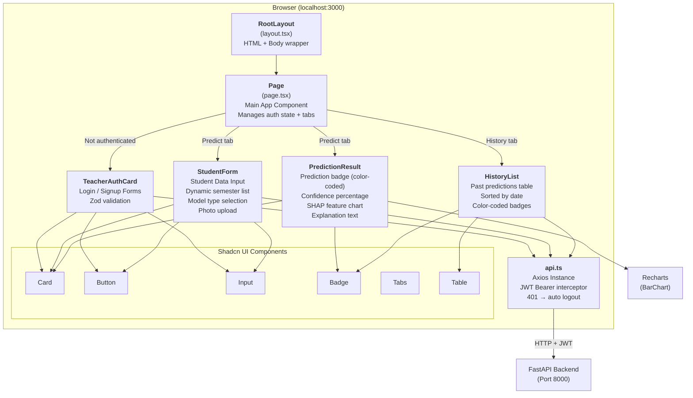

# Class & Component Diagram

## Description

This document shows the backend class structure (Python classes with methods and attributes) and the frontend React component hierarchy.

---

## Backend Class Diagram

---

## Frontend Component Hierarchy

---

## Component Details

### Frontend Components

| Component | File | Props / State | Responsibility |
|-----------|------|--------------|----------------|
| **Page** | `page.tsx` | State: `token`, `activeTab` | Root component. Checks localStorage for JWT. Renders auth card or main interface with tabs |
| **TeacherAuthCard** | `TeacherAuthCard.tsx` | Props: `onLogin(token)`. State: `mode` (login/signup), form fields, `error`, `loading` | Handles teacher authentication. Validates with Zod. Calls POST `/auth/signup` or `/auth/login` |
| **StudentForm** | `StudentForm.tsx` | Props: `token`, `onResult(data)`. State: `semesters[]`, `modelType`, `loading` | Multi-field form with dynamic semester management. Validates constraints. Calls POST `/predict` |
| **PredictionResult** | `PredictionResult.tsx` | Props: `result` (prediction data) | Renders prediction badge (green/yellow/red), confidence %, model name, and SHAP contribution bar chart |
| **HistoryList** | `HistoryList.tsx` | Props: `token`. State: `records[]`, `loading` | Fetches and displays prediction history table from GET `/history` |
| **api.ts** | `lib/api.ts` | Axios instance | Configured with base URL (localhost:8000). Interceptor adds JWT Bearer header. On 401, clears token and dispatches logout event |

### Backend Classes

| Class | File | Key Methods | Responsibility |
|-------|------|-------------|----------------|
| **FastAPIApp** | `main.py` | `predict()`, `teacher_signup()`, `teacher_login()`, `history()` | Route handler with all endpoint logic, feature engineering, and rule override |
| **PredictorService** | `services/predictor.py` | `predict()`, `_predict_ml()`, `_predict_dl()`, `_explain_ml()`, `_explain_dl()` | Lazy-loads models, runs inference, generates SHAP explanations |
| **AuthModule** | `auth.py` | `hash_password()`, `verify_password()`, `create_access_token()`, `get_current_teacher()` | JWT token management and password hashing |
| **Teacher** | `database/models.py` | — (ORM model) | SQLAlchemy model for the `teachers` table |
| **PredictionRecord** | `database/models.py` | — (ORM model) | SQLAlchemy model for the `prediction_records` table |
| **StudentInput** | `schemas/student.py` | — (Pydantic model) | Request validation for prediction endpoints |
| **PredictionOutput** | `schemas/student.py` | — (Pydantic model) | Response schema for prediction results |
