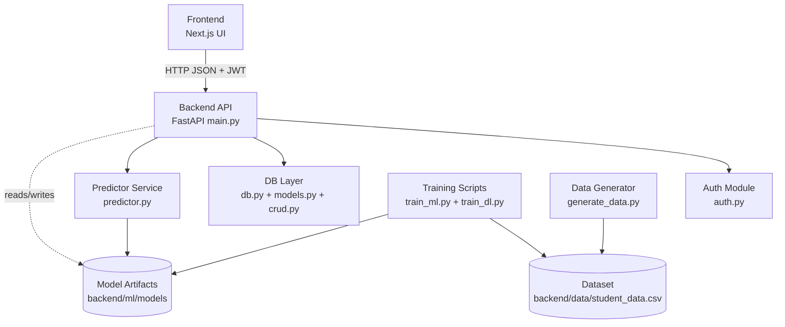
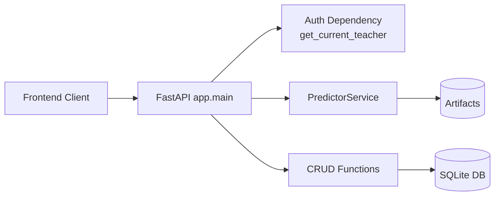

# Module Design — Student Performance Analyzer

This document describes the **module design** of the Student Performance Analyzer project: module boundaries, responsibilities, interfaces, and dependencies.

---

## 1) Design goals

- **Separation of concerns**
  - UI concerns in Frontend
  - Business logic + orchestration in Backend
  - Persistence in Database layer
  - ML/DL training isolated from runtime inference
- **Maintainability**
  - Clear module ownership and file-level separation
- **Reusability**
  - Predictor service can be reused by multiple endpoints
- **Testability**
  - DB CRUD and API endpoints can be tested independently

---

## 2) Module decomposition (top-level)

### M1: Frontend (Presentation Layer)
- **Location**: `frontend/`
- **Responsibility**:
  - Teacher authentication UI
  - Student input UI
  - Prediction results visualization
  - History visualization
- **Interfaces**:
  - Calls Backend REST APIs over HTTP using Axios

### M2: Backend API (Application Layer)
- **Location**: `backend/app/`
- **Responsibility**:
  - REST endpoints
  - Request validation
  - Authentication enforcement
  - Coordination between DB and Predictor service

### M3: Auth (Security Subsystem)
- **Location**: `backend/app/auth.py`
- **Responsibility**:
  - Password hashing/verification
  - JWT token issue/verification
  - Dependency to load current teacher

### M4: Database (Persistence Layer)
- **Location**: `backend/app/database/`
- **Responsibility**:
  - DB engine/session management
  - ORM models
  - CRUD operations

### M5: Predictor (Inference + Explainability)
- **Location**: `backend/app/services/predictor.py`
- **Responsibility**:
  - Load artifacts from `backend/ml/models/`
  - Run inference for ML/DL
  - Produce explainability contributions (SHAP)

### M6: Training + Data generation (Offline/Build-time ML)
- **Location**: `backend/data/` and `backend/ml/`
- **Responsibility**:
  - Create dataset (`student_data.csv`)
  - Train ML model and DL model
  - Save artifacts to `backend/ml/models/`

---

## 3) Module dependency graph (who depends on whom)

### Mermaid (renders on GitHub)

---

## 4) Interfaces (module contracts)

### 4.1 Frontend → Backend API

- **Transport**: HTTP (JSON)
- **Auth**: `Authorization: Bearer <JWT>` header
- **Base URL**: `http://localhost:8000` (configured in `frontend/src/lib/api.ts`)

Key API interactions:
- Signup/Login → token
- Predict → prediction label + confidence + contributions
- History → list of prediction records

### 4.2 Backend API → Predictor service

- **Interface**: `PredictorService.predict(payload, model_type)`
- **Payload**: fixed features (age + sem1..sem8 internal/university/attendance)
- **Output**:
  - prediction label
  - confidence score
  - model name used
  - per-feature contributions

### 4.3 Backend API → Database CRUD

- **Create prediction record**
- **List prediction records**
- **Optional photo storage**

---

## 5) Component design (inside Backend)

### 5.1 Backend components

- **Router/Controller layer**: `backend/app/main.py`
  - Handles HTTP and converts it to internal calls
- **Service layer**: `backend/app/services/predictor.py`
  - Encapsulates ML/DL inference + SHAP explanation
- **Persistence layer**: `backend/app/database/*`
  - Encapsulates storage
- **Security layer**: `backend/app/auth.py`
  - Encapsulates authentication

### Mermaid (backend component view)

---

## 6) Data design (what each data store contains)

### 6.1 SQLite DB (`backend/student_performance.db`)
Contains:
- Teacher records (email, password hash, name)
- Prediction records (student info + prediction output + optional photo)

### 6.2 Model artifacts (`backend/ml/models/`)
Contains:
- `rf_model.joblib` (Random Forest)
- `dl_model.keras` (Neural Network)
- `scaler.joblib` (StandardScaler)
- `label_map.json` (class index to label)
- `background.npy` (SHAP background sample)

---

## 7) Module design justification (viva-ready)

- **Why separate training from inference?**
  - Training is offline and time-consuming; inference must be fast and consistent.
- **Why a predictor service class?**
  - Centralized logic for loading artifacts and predicting; avoids duplication across endpoints.
- **Why CRUD layer?**
  - Keeps DB queries out of controller code; easier to test and maintain.
- **Why JWT?**
  - Stateless auth; frontend can carry token and backend validates each request.
