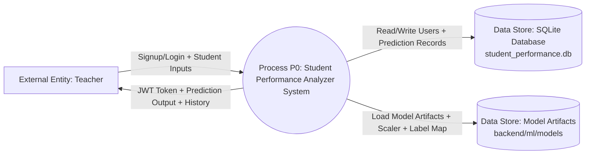

# Data Flow Diagram (DFD) — Level 0 (Context Diagram)

This is the **Level 0 DFD** (also called the **Context Diagram**). It shows the system as a single process and the external entities interacting with it.

---

## Level 0 — Mermaid diagram

---

## Level 0 — Word-friendly (plain text)

### External entity
- **Teacher** (person using the web application)

### Process
- **P0: Student Performance Analyzer System**
  - UI (frontend) + API (backend) together are treated as one system at Level 0

### Data stores
- **D1: SQLite Database (`backend/student_performance.db`)**
  - Stores teacher accounts and prediction history
- **D2: Model Artifacts (`backend/ml/models/`)**
  - Stores trained models and related files used for inference

### Data flows
- **Teacher → System**
  - Signup/Login data
  - Student academic details (age, sem marks, attendance)
  - Model selection (ML/DL)
- **System → Teacher**
  - JWT token (after auth)
  - Prediction label + confidence
  - Feature contributions/explanations
  - Prediction history list
- **System ↔ Database**
  - Store/read teacher and prediction records
- **System → Model Artifacts**
  - Load trained model files and scaler
