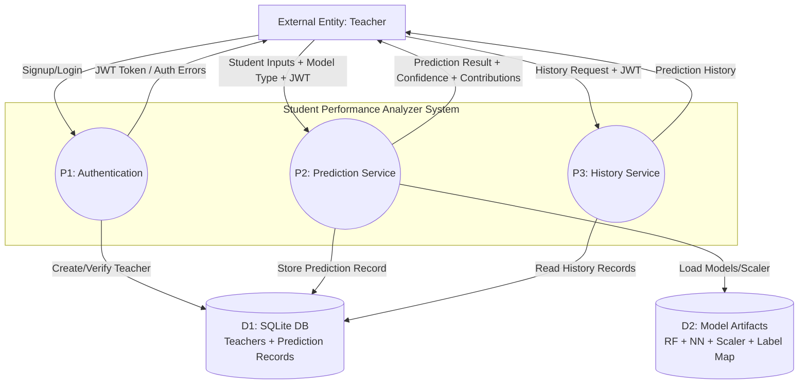

# Data Flow Diagram (DFD) — Level 1

This **Level 1 DFD** decomposes the system into its major processes:
- Authentication (teacher signup/login)
- Prediction
- History

---

## Level 1 — Mermaid diagram

---

## Level 1 — Word-friendly process breakdown

### P1: Authentication
- **Inputs**:
  - Email, password, (optional) name for signup
- **Outputs**:
  - JWT access token
  - Errors for invalid credentials / already registered
- **Data store used**:
  - D1 (Teachers table)

### P2: Prediction Service
- **Inputs**:
  - JWT token
  - Student details (age, semesters)
  - Model type (`ml` or `dl`)
- **Outputs**:
  - Predicted label + confidence
  - Feature contributions (SHAP)
  - Stored record id
- **Data stores used**:
  - D2 (model artifacts)
  - D1 (store a new prediction record)

### P3: History Service
- **Inputs**:
  - JWT token
  - Pagination/filter inputs (if supported)
- **Outputs**:
  - List of previous prediction records
- **Data store used**:
  - D1 (Prediction records)

---

## Level 1 sublevels (what happens inside each process)

### P1 sublevel (P1.1..P1.3)
- **P1.1 Validate input** (email format, password length)
- **P1.2 Hash/verify password** (`passlib` + `bcrypt`)
- **P1.3 Issue JWT token** (`python-jose`)

### P2 sublevel (P2.1..P2.6)
- **P2.1 Validate JWT** (teacher must be logged in)
- **P2.2 Build full 8-semester feature vector** (fill missing semesters)
- **P2.3 Scale features** (StandardScaler)
- **P2.4 Predict probabilities** (RF or NN)
- **P2.5 Explain prediction** (SHAP contributions; best-effort)
- **P2.6 Store prediction record** (SQLite)

### P3 sublevel (P3.1..P3.3)
- **P3.1 Validate JWT**
- **P3.2 Query DB** for teacher’s past predictions
- **P3.3 Return results to UI**
