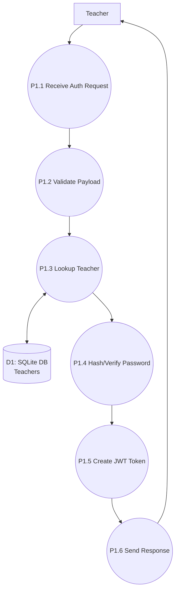
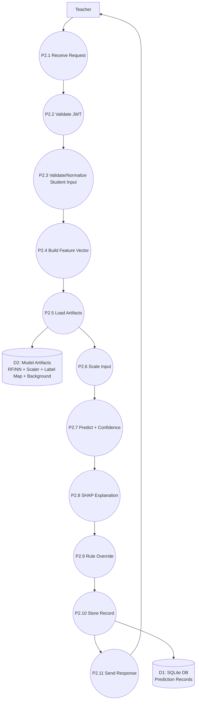
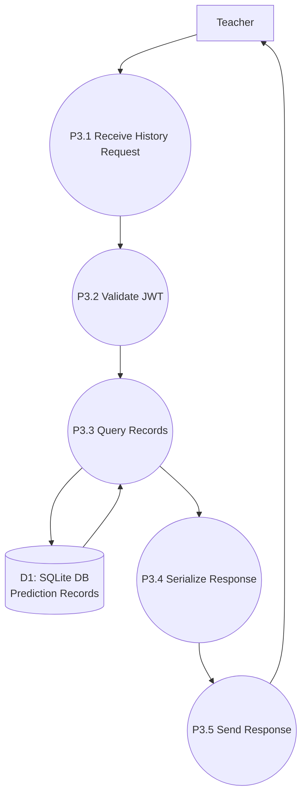

# Data Flow Diagram (DFD) — Level 2 (with sublevels)

This **Level 2 DFD** further decomposes the Level 1 processes into detailed sub-processes and shows the data moving between them.

---

## 1) Level 2 for P1: Authentication

### P1 decomposition
- **P1.1** Receive signup/login request
- **P1.2** Validate request payload (schema validation)
- **P1.3** Check teacher record in DB
- **P1.4** Hash password (signup) / verify password (login)
- **P1.5** Generate JWT token
- **P1.6** Return token/response

### Mermaid

---

## 2) Level 2 for P2: Prediction Service

### P2 decomposition
- **P2.1** Receive prediction request + JWT + model_type
- **P2.2** Validate JWT token (teacher must be authenticated)
- **P2.3** Validate + normalize student input
- **P2.4** Construct full feature vector (age + sem1..sem8 fields)
- **P2.5** Load model artifacts (RF/NN + scaler + label_map)
- **P2.6** Scale input using saved scaler
- **P2.7** Predict probabilities and choose label
- **P2.8** Explain with SHAP contributions (best-effort)
- **P2.9** Apply rule-based override (hybrid logic)
- **P2.10** Store prediction record to DB
- **P2.11** Return prediction response

### Mermaid

---

## 3) Level 2 for P3: History Service

### P3 decomposition
- **P3.1** Receive history request + JWT
- **P3.2** Validate JWT
- **P3.3** Query prediction records from DB
- **P3.4** Serialize records
- **P3.5** Return history response

### Mermaid

---

## Word-friendly Level 2 tables

### P2 (Prediction) inputs/outputs table

| Subprocess | Input | Output |
|---|---|---|
| P2.2 Validate JWT | JWT token | teacher_id / auth error |
| P2.4 Build Feature Vector | semesters list | 25-length vector payload |
| P2.5 Load Artifacts | model_type | model + scaler + label_map |
| P2.7 Predict | scaled vector | proba + predicted class |
| P2.8 Explain | scaled vector | contributions per feature |
| P2.10 Store Record | prediction result | record_id |
