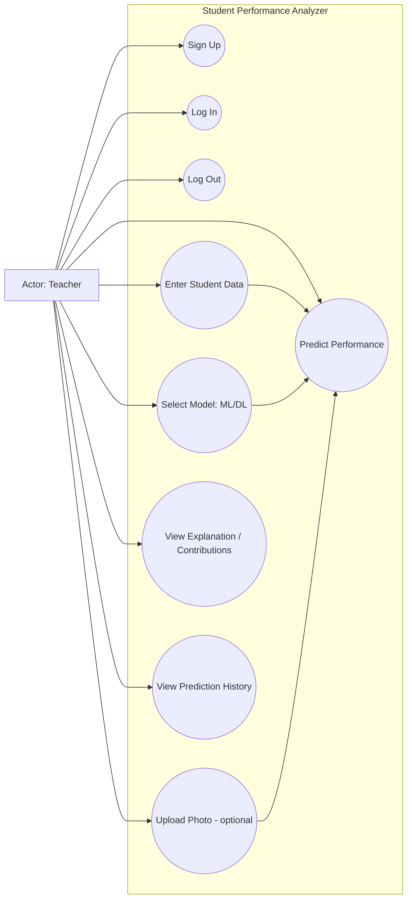
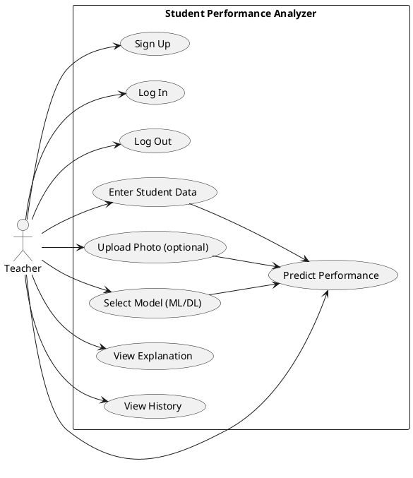

# Use Case Diagrams

This file contains the **Use Case diagrams** for the Student Performance Analyzer.

Actors:
- **Teacher** (primary)

System:
- **Student Performance Analyzer Web App**

---

## Use Case Diagram — Overview (Mermaid)

---

## Use Case Specifications (Word-friendly)

### UC1: Sign Up
- **Actor**: Teacher
- **Preconditions**:
  - Teacher is not logged in
- **Main flow**:
  - Teacher enters email + password (+ optional name)
  - System validates and creates teacher record
  - System returns JWT token
- **Postconditions**:
  - Teacher is registered and authenticated
- **Failure cases**:
  - Email already registered
  - Invalid input

### UC2: Log In
- **Actor**: Teacher
- **Preconditions**:
  - Teacher already has an account
- **Main flow**:
  - Teacher enters email + password
  - System verifies and returns JWT
- **Failure cases**:
  - Wrong email/password

### UC4: Enter Student Data
- **Actor**: Teacher
- **Preconditions**:
  - Teacher is logged in
- **Main flow**:
  - Teacher enters age and semester details (marks + attendance)
  - System validates inputs

### UC6: Select Model (ML/DL)
- **Actor**: Teacher
- **Preconditions**:
  - Teacher is logged in
- **Main flow**:
  - Teacher chooses `ml` or `dl`

### UC7: Predict Performance
- **Actor**: Teacher
- **Preconditions**:
  - Teacher is logged in
  - Model artifacts exist OR training has been run
- **Main flow**:
  - System runs inference and returns label + confidence
  - System stores prediction in DB
- **Failure cases**:
  - Missing model artifacts
  - Backend not running

### UC8: View Explanation / Contributions
- **Actor**: Teacher
- **Preconditions**:
  - Prediction has been performed
- **Main flow**:
  - System shows feature contribution values (SHAP)

### UC9: View Prediction History
- **Actor**: Teacher
- **Preconditions**:
  - Teacher is logged in
- **Main flow**:
  - Teacher opens History tab
  - System loads stored prediction records

---

## Optional: Use Case Diagram (PlantUML)

If you prefer PlantUML (easy to export as image in many tools), use this:

