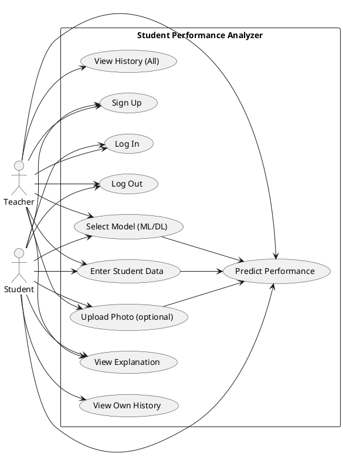

# Use Case Diagrams

This file contains the **Use Case diagrams** for the Student Performance Analyzer.

Actors:
- **Teacher** (primary)
- **Student**

System:
- **Student Performance Analyzer Web App**

---

## Use Case Diagram — Overview (Mermaid)

```mermaid
flowchart LR
  Teacher[Actor: Teacher]
  Student[Actor: Student]

  subgraph System[Student Performance Analyzer]
    UC1((Sign Up))
    UC2((Log In))
    UC3((Log Out))
    UC4((Enter Student Data))
    UC5((Upload Photo - optional))
    UC6((Select Model: ML/DL))
    UC7((Predict Performance))
    UC8((View Explanation / Contributions))
    UC9((View Prediction History (All)))
    UC10((View Own Prediction History))
  end

  Teacher --> UC1
  Teacher --> UC2
  Teacher --> UC3
  Teacher --> UC4
  Teacher --> UC6
  Teacher --> UC7
  Teacher --> UC8
  Teacher --> UC9
  Teacher --> UC5

  UC4 --> UC7
  UC6 --> UC7
  UC5 --> UC7
```

---

## Use Case Specifications (Word-friendly)

### UC1: Sign Up
- **Actor**: Teacher / Student
- **Preconditions**:
  - User is not logged in
- **Main flow**:
  - User enters email + password (+ optional name)
  - System validates and creates a teacher/student record
  - System returns JWT token (includes role claim)
- **Postconditions**:
  - User is registered and authenticated
- **Failure cases**:
  - Email already registered
  - Invalid input

### UC2: Log In
- **Actor**: Teacher / Student
- **Preconditions**:
  - User already has an account
- **Main flow**:
  - User enters email + password
  - System verifies and returns JWT
- **Failure cases**:
  - Wrong email/password

### UC4: Enter Student Data
- **Actor**: Teacher / Student
- **Preconditions**:
  - User is logged in
- **Main flow**:
  - User enters age and semester details (marks + attendance)
  - System validates inputs

### UC6: Select Model (ML/DL)
- **Actor**: Teacher / Student
- **Preconditions**:
  - User is logged in
- **Main flow**:
  - User chooses `ml` or `dl`

### UC7: Predict Performance
- **Actor**: Teacher / Student
- **Preconditions**:
  - User is logged in
  - Model artifacts exist OR training has been run
- **Main flow**:
  - System runs inference and returns label + confidence
  - System stores prediction in DB
- **Failure cases**:
  - Missing model artifacts
  - Backend not running

### UC8: View Explanation / Contributions
- **Actor**: Teacher / Student
- **Preconditions**:
  - Prediction has been performed
- **Main flow**:
  - System shows feature contribution values (SHAP)

### UC9: View Prediction History (All)
- **Actor**: Teacher
- **Preconditions**:
  - Teacher is logged in
- **Main flow**:
  - Teacher opens History tab
  - System loads stored prediction records

### UC10: View Own Prediction History
- **Actor**: Student
- **Preconditions**:
  - Student is logged in
- **Main flow**:
  - Student opens History tab
  - System loads stored prediction records owned by the logged-in student

---

## Optional: Use Case Diagram (PlantUML)

If you prefer PlantUML (easy to export as image in many tools), use this:

```plantuml
@startuml
left to right direction
actor Teacher
actor Student
rectangle "Student Performance Analyzer" {
  usecase "Sign Up" as UC1
  usecase "Log In" as UC2
  usecase "Log Out" as UC3
  usecase "Enter Student Data" as UC4
  usecase "Upload Photo (optional)" as UC5
  usecase "Select Model (ML/DL)" as UC6
  usecase "Predict Performance" as UC7
  usecase "View Explanation" as UC8
  usecase "View History (All)" as UC9
  usecase "View Own History" as UC10
}
Teacher --> UC1
Teacher --> UC2
Teacher --> UC3
Teacher --> UC4
Teacher --> UC5
Teacher --> UC6
Teacher --> UC7
Teacher --> UC8
Teacher --> UC9
Student --> UC1
Student --> UC2
Student --> UC3
Student --> UC4
Student --> UC5
Student --> UC6
Student --> UC7
Student --> UC8
Student --> UC10
UC4 --> UC7
UC6 --> UC7
UC5 --> UC7
@enduml
```
